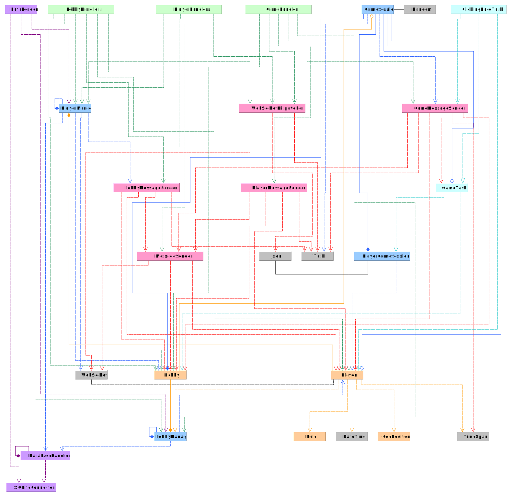

# Use Case Diagrams

To understand how the application should work (as it was thought of in the beginning of the project) we designed the following **use case diagrams**.

For the functionality of the application (outside the actual game):

.svg)

And for the game itself:

.svg)

❗<mark>TODO: implement some of the functionalities that are missing from these diagrams</mark>

# General Architecture Diagram

The project is divided into two main sections: the **Flutter app** and the **server**. It is a multiplayer app where each *client* (player) has an instance of the Flutter application and the *server* is unique. 
There is a constant communication between the two, shown in the diagram below together with a simple illustration of the main classes and files of the project and how they are related to each other:

## Flutter end
In Flutter the starting file is `main.dart`. It is in charge of:
* Creating the `context` (`BuildContext` that is used in the widget tree of the app).
* Initialize the states (data for the application that is updated throughout the session).
* Initialize the router (app navigation tool).
* Start and establish connections via web socket.
* Create a dispatcher (element that handles the messages received from the web socket).
* Initializes and registers the handlers (responsible of decoding the message).

The basic app cycle is:
1. Through the UI, the client creates a trigger.
2. That trigger modifies the UI and/or sends a message to the server to perform an action.
3. When the server processes and sends a response, via the `websocket_service` the `action_dispatcher` redirects the message to the adequate `handler`.
4. The handlers modify the `states` and make the UI respond by changing the pages, widgets and data in the app.

## Server end
In the server, the starting file is `Program.cs`. It is in charge of:
* Create (not implemented), and/or make a connection with the database.
* Load the data from the database in case it was already created.
* Start the web sockets connection to make connections with potential clients.
* Initialize a dispatcher to receive messages from the clients though the web sockets.

The basic server cycle is:
1. The server establishes connection with clients.
2. From the connected clients, it receives a message though the web sockets and via the `WebSocketActionDispatcher` it redirects the message to the correct `Handler`.
3. The handlers get the data from the messages and can:
	1. Send a message back to the client directly (e.g., when an error has occurred).
	2. Modify the `Managers` and either send a message back to the client or change/store data in the database (or both).
   
# Database Architecture

The structure of the database can be seen in the following ER diagrams:

❗<mark>TODO: not everything is implemented as described in the diagram, in the current implementation the Players table has the `id`, the `email`, and the `username` as PK. But the authentication is not implemented, which should be done (ideally)</mark>

❗<mark>TODO: add the new properties of a lobby as needed in the Lobbies table.</mark>

# Server UML Diagram
In the server, the classes have the following descriptions:

And the relationships between them are explained by the following UML diagram:

❗<mark>TODO: there are quite a few inconsistencies and, possibly, better ways and programming patterns that could be applied to the classes. For instance, make the *MessageSender* the parent of *Game/Lobby/PlayerMessageSender* in a generalization relationship.</mark>

# Flutter Classes Diagram
In Flutter, we distinguish between classes and *pages* and *widgets*. 

## Classes
The classes in the Flutter end are the following, in the described relationships of the UML diagram:

## Navigation & UI
For the navigation, we used two main methods:
1. The `router`: its functionality is basically to 'listen' to the states and change the pages accordingly using its predefined routes.
2. The `rootNavigationKey` is used to get the current `BuildContext` at any moment so it is easier to display errors and messages in the screen on top of the page.

❗<mark>TODO: The back-button of the phones does not work (crashes the application when it looses the `BuildContext`) because the default navigation system of Flutter is no longer used. It is a problem that should be fixed.</mark>

For the pages, this is a brief description of the pages and their navigation, and where the widgets are used:

The directory between `''` under the name of the pages is the route defined in the `router` to go to that page.